<!-- Animated developer profile · pure SVG/CSS · no JS · dark & light adaptive -->
<picture>
  <source media="(prefers-color-scheme: dark)" srcset="profile-dark.svg">
  <source media="(prefers-color-scheme: light)" srcset="profile-light.svg">
  
</picture>

## ⭐ Featured Projects

| Project | What it does | Built with |
|---------|--------------|------------|
| **Bedrock Router Platform** | Serverless AI gateway — one-click deployment & unified access to Amazon Bedrock foundation models, with a dashboard for request monitoring, token usage & cost analytics | Next.js · AWS Lambda · PostgreSQL · Bedrock · CDK |
| **Weather Intelligence Platform** | Ask 50+ years of weather data questions in plain English — LLM-powered NL2SQL over a PostgreSQL + S3 data-lake pipeline with hourly ingestion | Next.js · PostgreSQL · S3 · Lambda · LLMs |
| **RAG Chatbot — Spring AI** | Retrieval-augmented chatbot with OpenAI embeddings, Pinecone/pgvector semantic search & SSE streaming for low-latency answers | Spring Boot · Spring AI · Pinecone · pgvector |

## 🤝 Connect With Me

⚡ Profile art is a hand-built animated SVG — no JavaScript, fully GitHub-native.

